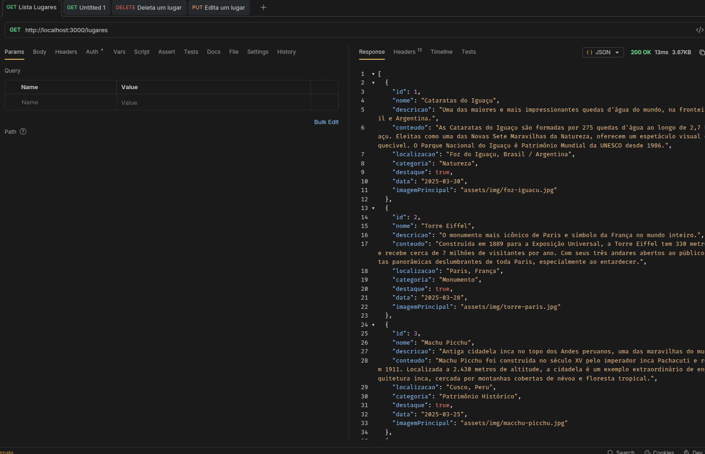
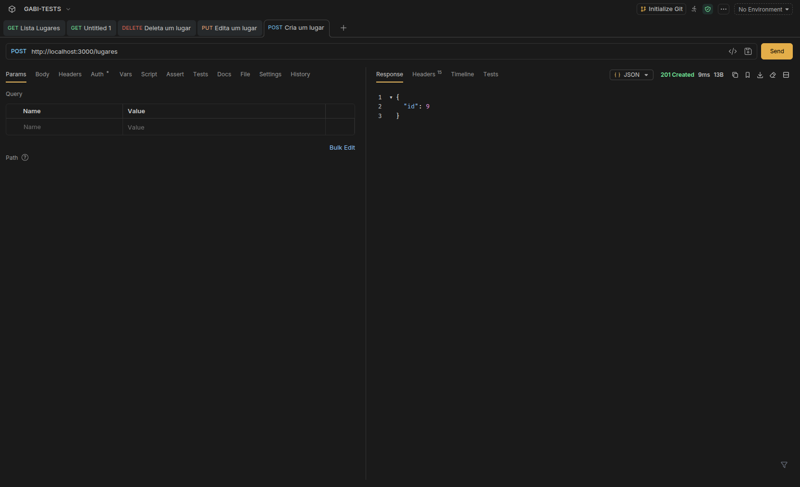
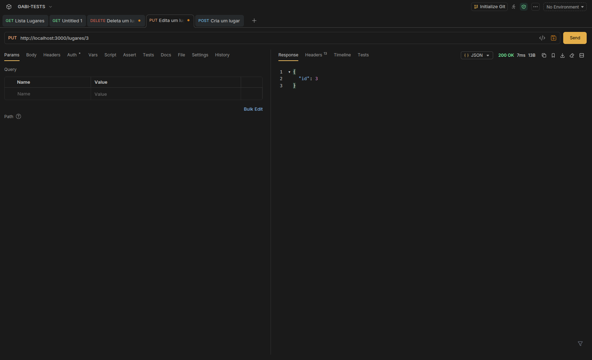
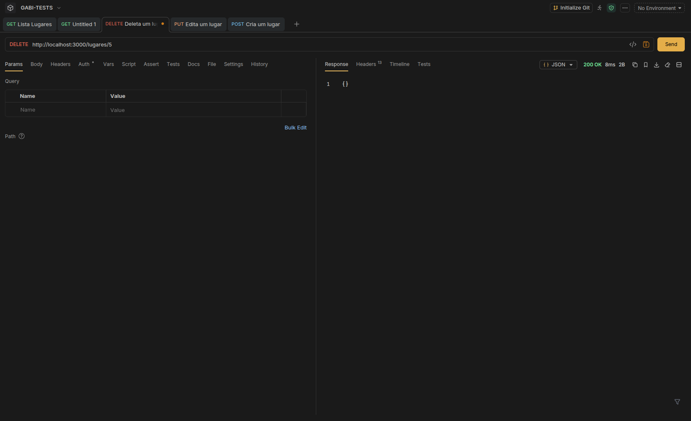
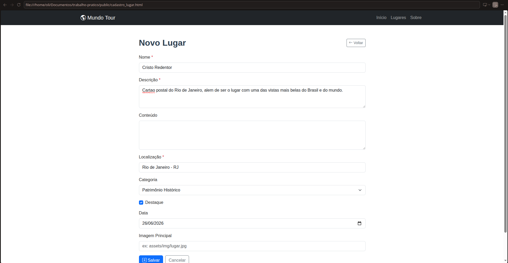
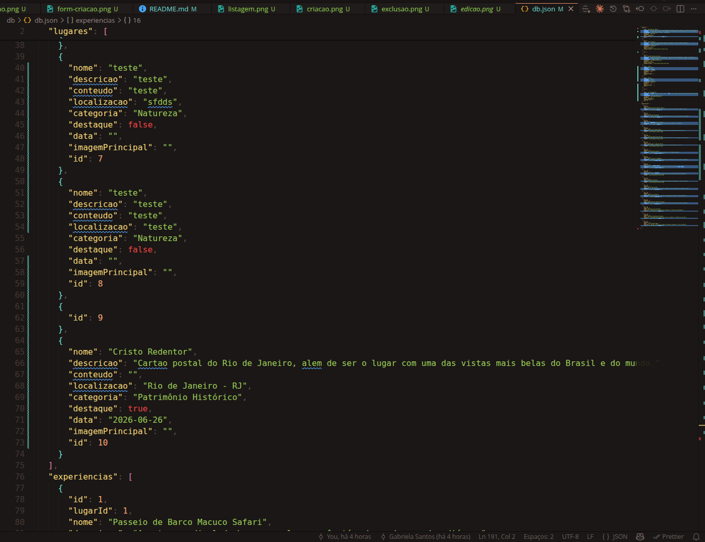

# Mundo Tour

## Identificação

| Campo          | Valor                             |
| -------------- | --------------------------------- |
| **Aluno**      | Gabriela Santos                   |
| **Matrícula**  | 710397                            |
| **Disciplina** | Desenvolvimento de Interfaces Web |
| **Curso**      | Engenharia Civil                  |
| **Turma**      | Noite                             |

---

## Descrição do Projeto

O **Mundo Tour** é uma aplicação web para listagem e gerenciamento de lugares turísticos ao redor do mundo. O projeto utiliza **HTML**, **CSS**, **JavaScript vanilla** e **Fetch API** para consumir uma API REST local fornecida pelo **JSON Server**.

A aplicação permite ao usuário:

- Visualizar lugares em destaque em um carrossel dinâmico
- Listar todos os lugares cadastrados em cards responsivos
- Cadastrar novos lugares via formulário
- Editar dados de um lugar existente
- Excluir um lugar diretamente da listagem
- Ver detalhes completos de um lugar, incluindo experiências relacionadas

### Entidade: `lugares`

A entidade principal do projeto representa um lugar turístico com os seguintes campos:

| Campo             | Tipo    | Descrição                                                    |
| ----------------- | ------- | ------------------------------------------------------------ |
| `id`              | number  | Identificador único (gerado pelo JSON Server)                |
| `nome`            | string  | Nome do lugar                                                |
| `descricao`       | string  | Descrição curta exibida nos cards                            |
| `conteudo`        | string  | Texto detalhado exibido na página de detalhes                |
| `localizacao`     | string  | Cidade/país do lugar                                         |
| `categoria`       | string  | Enum: Natureza, Monumento, Patrimônio Histórico, Ilha, Outro |
| `destaque`        | boolean | `true` exibe o lugar no carrossel da página inicial          |
| `data`            | string  | Data de publicação no formato `YYYY-MM-DD`                   |
| `imagemPrincipal` | string  | Caminho relativo da imagem (ex: `assets/img/foto.jpg`)       |

---

## Estrutura de Dados JSON

Exemplo de objeto completo da entidade `lugares`:

```json
{
  "id": 1,
  "nome": "Cataratas do Iguaçu",
  "descricao": "Uma das maiores e mais impressionantes quedas d'água do mundo, na fronteira entre Brasil e Argentina.",
  "conteudo": "As Cataratas do Iguaçu são formadas por 275 quedas d'água ao longo de 2,7 km do Rio Iguaçu. Eleitas como uma das Novas Sete Maravilhas da Natureza, oferecem um espetáculo visual e sonoro inesquecível. O Parque Nacional do Iguaçu é Patrimônio Mundial da UNESCO desde 1986.",
  "localizacao": "Foz do Iguaçu, Brasil / Argentina",
  "categoria": "Natureza",
  "destaque": true,
  "data": "2025-03-30",
  "imagemPrincipal": "assets/img/foz-iguacu.jpg"
}
```

---

## Como Rodar o Projeto

### Pré-requisitos

- [Node.js](https://nodejs.org/) instalado (versão 14 ou superior)
- Navegador web moderno (Chrome, Firefox, Edge)

### Instalação

```bash
# 1. Clone o repositório
git clone https://github.com/gabi-puc/Semanas-16-e-17---Atividade-Pr-tica.git
cd trabalho-pratico

# 2. Instale as dependências
npm install
```

### Executar

```bash
# Inicia o JSON Server na porta 3000 com os arquivos estáticos em public/
npm start
```

### Acessar no Navegador

Abra o navegador e acesse:

```
http://localhost:3000
```

As páginas disponíveis são:

- `http://localhost:3000` — Listagem de lugares com carrossel e cards
- `http://localhost:3000/detalhes.html?id=1` — Detalhes de um lugar
- `http://localhost:3000/cadastro_lugar.html` — Cadastrar novo lugar
- `http://localhost:3000/cadastro_lugar.html?id=1` — Editar um lugar existente

---

## Prints

### Tela inicial — Listagem de lugares



### Formulário de cadastro



### Formulário de edição



### Excluir lugar



### Testes no Postman / Insomnia





---

## Tecnologias Utilizadas

- **HTML5** — estrutura das páginas
- **CSS3** + **Bootstrap 5.3.3** — estilização responsiva
- **Bootstrap Icons 1.11.3** — ícones
- **JavaScript (ES6+)** — lógica da aplicação
- **Fetch API** — comunicação com a API REST
- **JSON Server 0.17** — API REST local com arquivo `db/db.json`
